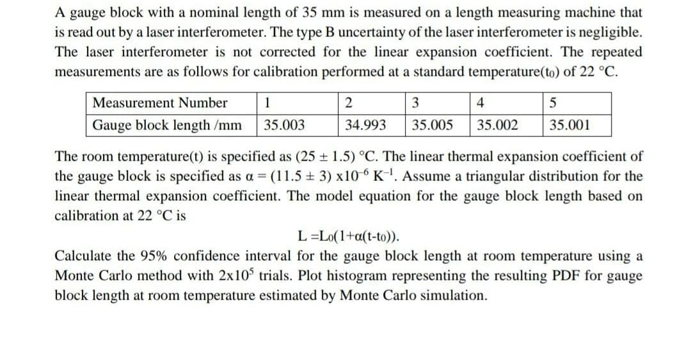

# Monte Carlo Simulation for Confidence Intervals of Laser-Infernometer Gauge Block Readings
This Jupyter Notebook performs Monte Carlo simulations to determine the confidence interval limits for gauge block readings of a Laser-Infernometer. The simulations incorporate thermal expansion coefficients to account for temperature variations affecting the gauge block measurements.

